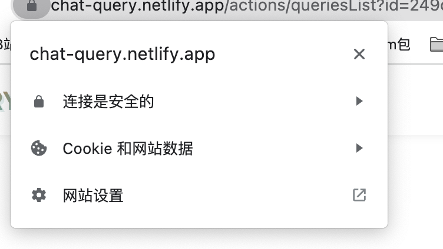

# CHAT-QUERY

[中文](./README-zh.md)

> Chat-Query is a data query tool based on metadata models and AI technology, enabling natural language queries.

## Demo
> [view](https://chat-query.netlify.app/) **Due to network restrictions on Netlify, please try to choose one of the following modes:**

+ Choose website settings 
+ Allow Unsafe Content 

> [demo](https://cdn.glitch.me/fd139a45-4a65-41b6-9634-41617ab20cdc/%E6%BC%94%E7%A4%BA.gif?v=1686907695067)

+ **Features🐂:**

	- Supports importing DDL, DBML, and reverse database parsing, with AI automatically generating business models.
	- Provides basic CRUD functionality for business models, AI intelligent analysis, and supports exporting models as DDL, DBML, and synchronizing with databases.
	- Combines models and AI to enable natural language data queries, which can be added to the query list and called via API.

## Application Scenarios🎬

+ From low-code to no-code development.
+ Non-business users can quickly perform data analysis.
+ More application scenarios to be explored...

## Development Environment Setup

> 👏 Welcome to contribute to the development of Chat-Query.

+ Backend:

  ```js
		pnpm start:dev
	```
	- Add environement variables such as OPEN_AI_API_KEY = 'sk-...' to the .env file

+ Frontend

	```js
		pnpm install
		pnpm dev
	```
	- Add OPEN_AI_API_KEY='sk-...' in components/AITool/TOKEN.ts

## System Architecture

.png?v=1686908252244)